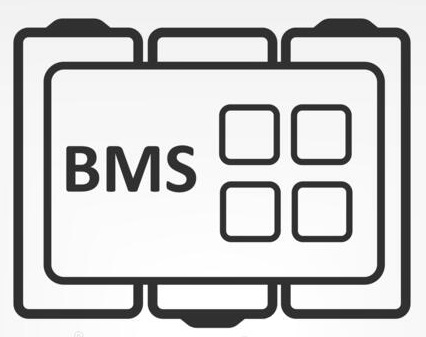
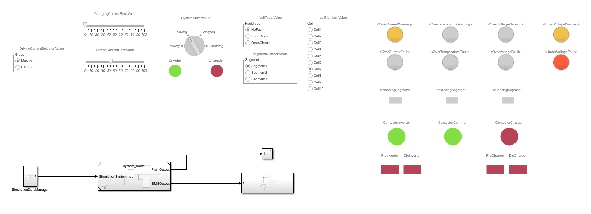

<!-- PROJECT SHIELDS -->
<!--
*** I'm using markdown "reference style" links for readability.
*** Reference links are enclosed in brackets [ ] instead of parentheses ( ).
*** See the bottom of this document for the declaration of the reference variables
*** for contributors-url, forks-url, etc. This is an optional, concise syntax you may use.
*** https://www.markdownguide.org/basic-syntax/#reference-style-links
-->
[![Contributors][contributors-shield]][contributors-url]
[![Forks][forks-shield]][forks-url]
[![Stargazers][stars-shield]][stars-url]
[![Issues][issues-shield]][issues-url]
[![MIT License][license-shield]][license-url]
<!-- [![LinkedIn][linkedin-shield]][linkedin-url] -->


<!-- PROJECT LOGO -->
<br />
<p align="center">
  <a href="https://github.com/meltinglab/battery-management">
    
  </a>

  <h3 align="center">Battery Management System</h3>

  <p align="center">
    Matlab implementation of a Battery Management System.
    <br />
    <a href="https://github.com/meltinglab/battery-management/wiki"><strong>Explore the docs »</strong></a>
    <br />
    <br />
    <a href="https://github.com/meltinglab/battery-management/blob/master/images/simUI.png">View Demo UI</a>
    ·
    <a href="https://github.com/meltinglab/battery-management/issues">Report Bug</a>
    ·
    <a href="https://github.com/meltinglab/battery-management/issues">Request Feature</a>
  </p>
</p>


<!-- TABLE OF CONTENTS -->
<details open="open">
  <summary><h2 style="display: inline-block">Table of Contents</h2></summary>
  <ol>
    <li>
      <a href="#about-the-project">About The Project</a>
      <ul>
        <li><a href="#built-with">Built With</a></li>
      </ul>
    </li>
    <li>
      <a href="#getting-started">Getting Started</a>
      <ul>
        <li><a href="#prerequisites">Prerequisites</a></li>
        <li><a href="#installation">Installation</a></li>
      </ul>
    </li>
    <li><a href="#usage">Usage</a></li>
    <li><a href="#roadmap">Roadmap</a></li>
    <li><a href="#contributing">Contributing</a></li>
    <li><a href="#license">License</a></li>
    <li><a href="#contact">Contact</a></li>
  </ol>
</details>


<!-- ABOUT THE PROJECT -->
## About The Project
<!-- [![Product Name Screen Shot][product-screenshot]](https://example.com) -->
The purpose of the project is to build from scratch a Battery Management System (BMS) by using a Model Based Design approach.
Starting from the plant definition (customizable), we proceeded with the design of the control strategies both for the cell balancing as well as for the pre-charge, post-discharge resistors and contactors management.
A complete [simulation enviroment](https://github.com/meltinglab/battery-management/blob/master/workspace/Simulation/simulationUI.slx) has been developed in order to test and appreciate all the functionalities.


### Built With

* [MATLAB](https://it.mathworks.com/products/matlab.html)
* [Simulink](https://it.mathworks.com/products/simulink.html)


<!-- GETTING STARTED -->
## Getting Started

To get a local copy up and running just follow these simple steps:

### Prerequisites
#### Software:

* Matlab v2021a
* Simulink v10.3

#### Toolbox:

* optimization_toolbox
* power_system_blocks
* simscape
* simulink_control_design
* simulink_design_optim
* stateflow

N.B: In order to get the list of in-use toolbox in a project use the following command (after run) :
   ```Matlab
   license('inuse')
   ```
<!-- #### (OPTIONAL) Hardware:
* STM32F4 Discovery 
-->
### Installation

1. Clone the repo
   ```sh
   git clone https://github.com/meltinglab/battery-management.git
   ```
2. Open the `simulationUI.slx` file under:
   ```sh
   ...\battery-management\workspace\Simulation\
   ```

<!-- USAGE EXAMPLES -->
## Usage
In order to test the whole system (plant+controller), just follow these steps:
1. Compile & Run by clicking on the "Play" button
2. Adjust the control parameters and evaluate the behavoiur at run-time

<p align="center">
  <a href="https://github.com/meltinglab/battery-management">
    
  </a>
</p>

_For more examples or a detailed description of all the blocks, please refer to the [Documentation](https://github.com/meltinglab/battery-management/wiki)_


<!-- ROADMAP -->
## Roadmap

See the [open issues](https://github.com/meltinglab/battery-management/issues) for a list of proposed features (and known issues).


<!-- CONTRIBUTING -->
## Contributing

Contributions are what make the open source community such an amazing place to be learn, inspire, and create. Any contributions you make are **greatly appreciated**.

1. Fork the Project
2. Create your Feature Branch (`git checkout -b feature/AmazingFeature`)
3. Commit your Changes (`git commit -m 'Add some AmazingFeature'`)
4. Push to the Branch (`git push origin feature/AmazingFeature`)
5. Open a Pull Request


<!-- LICENSE -->
## License

Distributed under the MIT License. See `LICENSE` for more information.


<!-- CONTACT -->
## Contact

Anna Delli Noci - [@Danidotwav](https://github.com/Danidotwav) - anna.dellinoci@studio.unibo.it

Michele Gazzarri - [@dinamitemic](https://github.com/dinamitemic) - michele.gazzarri@studio.unibo.it

Carlo Edoardo Malaspina - [@CarloEdoardoMalaspina](https://github.com/CarloEdoardoMalaspina) - carlo.malaspina@studio.unibo.it

Mirko Shtylla - [@mirkoshtylla](https://github.com/mirkoshtylla) - mirko.shtylla@studio.unibo.it


Project Link: [https://github.com/meltinglab/battery-management](https://github.com/meltinglab/battery-management)


<!-- ACKNOWLEDGEMENTS -->
<!-- ## Acknowledgements

* []()
* []()
* []()

-->


<!-- MARKDOWN LINKS & IMAGES -->
<!-- https://www.markdownguide.org/basic-syntax/#reference-style-links -->
[contributors-shield]: https://img.shields.io/github/contributors/meltinglab/battery-management.svg?style=for-the-badge
[contributors-url]: https://github.com/meltinglab/battery-management/graphs/contributors
[forks-shield]: https://img.shields.io/github/forks/meltinglab/battery-management.svg?style=for-the-badge
[forks-url]: https://github.com/meltinglab/battery-management/network/members
[stars-shield]: https://img.shields.io/github/stars/meltinglab/battery-management.svg?style=for-the-badge
[stars-url]: https://github.com/meltinglab/battery-management/stargazers
[issues-shield]: https://img.shields.io/github/issues/meltinglab/battery-management.svg?style=for-the-badge
[issues-url]: https://github.com/meltinglab/battery-management/issues
[license-shield]: https://img.shields.io/github/license/meltinglab/battery-management.svg?style=for-the-badge
[license-url]: https://github.com/meltinglab/battery-management/blob/master/LICENSE.txt
[linkedin-shield]: https://img.shields.io/badge/-LinkedIn-black.svg?style=for-the-badge&logo=linkedin&colorB=555
[linkedin-url]: https://linkedin.com/in/meltinglab